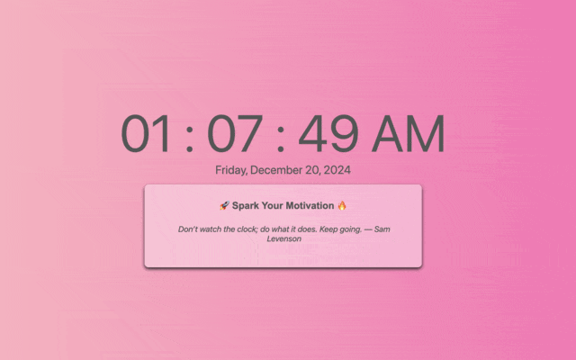

# Quote Clock

**Quote Clock** is a [Chrome extension](https://chromewebstore.google.com/detail/quote-clock/dbladalnnhlabhpnnjchhnaemidbkieo) designed to inspire and uplift your mindset every time you open a new tab. Stay motivated with curated quotes and keep track of time at a glance.

---

## 🚀 Features

- 🌟 **Motivational Quotes:** Inspiring quotes to boost positivity and productivity.
- ⏰ **Current Time Display:** Displays the current time for easy tracking.

---

## 🎥 Demo

*Experience the magic of Quote Clock in action!*

  

---

## 🛠 Installation

1. **Add to Chrome**:
   - Visit the [Chrome Web Store](https://chromewebstore.google.com/detail/quote-clock/dbladalnnhlabhpnnjchhnaemidbkieo) and click **Add to Chrome**.
2. **Setup**:
   - Once installed, open a new tab to experience Quote Clock.

---

## 📷 Screenshots

### New Tab Experience

### Motivational Quotes in Action

---

## 🔗 Links

- **Chrome Web Store**: [Quote Clock](https://chromewebstore.google.com/detail/quote-clock/dbladalnnhlabhpnnjchhnaemidbkieo)
- **GitHub Repository**: [View Source Code](https://github.com/LeadGeekSquad/QuoteClock)

---

## 🌟 Why Quote Clock?

Quote Clock was built to create small moments of positivity in our daily digital lives. It's more than just a new tab; it's a source of inspiration.

---

## 👥 Contributors

- **Naman** - Creator and Developer  

---

## 📬 Feedback

Have a feature request or found a bug? Feel free to [open an issue](https://github.com/LeadGeekSquad/QuoteClock/issues) or reach out via [email](mailto:npsupergeek@gmail.com).

---

## 🎉 Thank You

Thank you for supporting *Quote Clock*! If you find it valuable, consider leaving a review on the Chrome Web Store or starring this repository. 😊
